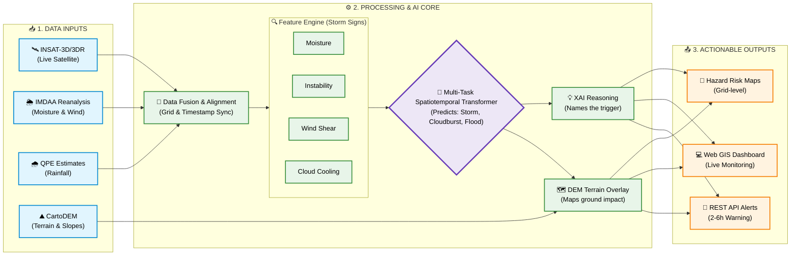

# 🏛️ HYPERCAST: Technical Architecture

Welcome to the technical backbone of **Hypercast** (PS 26077 - Team ARISHEM). This document provides a deep dive into our methodology, data flow, and the technology stack powering our AI-Driven Hyper-Local Early Warning System.

---

## 🌊 1. System Pipeline & Data Flow

Our architecture is designed for speed and precision, processing live satellite imagery and historical weather data through a spatiotemporal transformer to predict multiple hazards simultaneously.

## 🛠️ 2. Technology Stack

We have selected a robust, scalable, and open-source heavy stack to ensure feasibility and low-cost deployment.

| Category | Technologies Used | Purpose |
| :--- | :--- | :--- |
| **📡 Data Sources** | **INSAT-3D/3DR (MOSDAC)** | Live satellite imagery tracking rapid cloud-top cooling. |
| | **IMDAA Reanalysis** | Historical and current weather metrics (moisture, wind). |
| | **QPE & CartoDEM / SRTM** | Rainfall estimates and terrain elevation mapping. |
| **🧠 AI & ML Core** | **Spatiotemporal Transformer**| The primary backbone model learning linked hazard patterns. |
| | **Tree-based Baseline** | Fallback model for early validation and low-compute edge cases. |
| | **SHAP-style XAI** | Explainable AI reasoning to build trust in generated alerts. |
| **⚙️ Backend System**| **Python / Node.js** | Core data processing pipeline and fast API serving. |
| | **PostgreSQL + PostGIS** | Storing spatial data, risk grids, and geographic JSON (GeoJSON). |
| **💻 Frontend & UX** | **React.js + Leaflet/Mapbox**| Web GIS dashboard for live risk layer visualization. |
| | **REST API & Push Services** | Categorized warning delivery to First Responders & Authorities. |
| **☁️ Deployment** | **Cloud GPU Training** | Training the transformer on historical flood data (e.g., Aug 2023). |
| | **Edge / Cloud Inference** | Real-time, fast predictions based on incoming live data feeds. |

---
*Architected for speed, precision, and explainability.*
