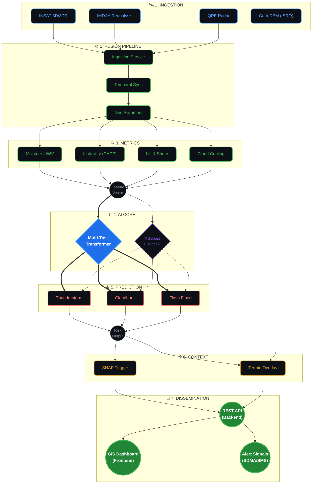

# 🏛️ HYPERCAST: System Architecture

HYPERCAST is designed to ingest multi-modal, asynchronous weather data, align it into a single spatiotemporal grid, extract thermodynamic features, and run a multi-task AI model to predict Thunderstorms, Cloudbursts, and Flash Floods simultaneously.

---

---

## 3. Component Breakdown

### 3.1 Data Ingestion & Fusion
Because data sources operate on different frequencies (e.g., INSAT images every 15-30 mins, Reanalysis every hour), the **Fusion Pipeline** uses temporal interpolation to normalize data to a single unified timestamp. Geospatial alignment projects this onto a high-resolution Cartesian grid covering the target region (e.g., Himachal Pradesh).

### 3.2 Spatiotemporal AI Core
- **Multi-Task Transformer (Primary):** Designed to handle both temporal sequences (how a cloud cools over time) and spatial relationships (how a storm moves across a grid). It is trained using a multi-task loss function to predict three interconnected hazards simultaneously.
- **XGBoost (Fallback):** A computationally lightweight tree-based ensemble model used to validate features during initial development and serve as a fail-safe in resource-constrained environments.

### 3.3 Explainable AI (XAI) Context Layer
The system employs **SHAP-style explainability** to break the "black box" of AI. When a flash flood alert is triggered, the system explicitly flags the dominant feature (e.g., "Trigger: Rapid Cloud-Top Cooling + Saturated Soil"). This transparency is critical for disaster authorities to trust the system.

### 3.4 Terrain Impact Mapping
While atmospheric models predict *where* it will rain, terrain models dictate *where* it will flood. The **Terrain Overlay** merges atmospheric risk probabilities with CartoDEM topographical data to highlight specific high-risk slopes, valleys, and river channels.

---

## 4. Software Stack

| Layer | Technologies |
| :--- | :--- |
| **Backend & APIs** | Python (FastAPI), Node.js |
| **Data Processing** | Pandas, GeoPandas, Xarray, GDAL |
| **AI / Machine Learning** | PyTorch (Transformer), XGBoost, SHAP |
| **Database** | PostgreSQL with PostGIS extension |
| **Frontend UI** | React.js, Leaflet / Mapbox GL JS |
| **Cloud Infrastructure** | Docker, Kubernetes (Proposed for scale) |
