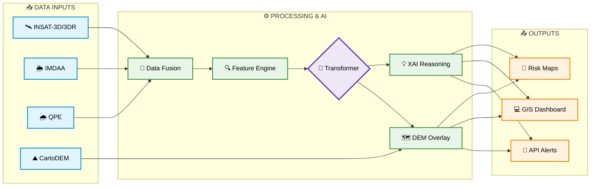

# 📋 HYPERCAST — Project Report

**AI-Driven Hyper-Local Early Warning System for Severe Weather Nowcasting**

| Field | Details |
| :--- | :--- |
| **Problem Statement ID** | 26077 |
| **Theme** | Disaster Management |
| **Category** | Software |
| **Team Name** | ARISHEM |
| **Hackathon** | Smart India Hackathon 2026 |

---

## Table of Contents

1. [Executive Summary](#-1-executive-summary)
2. [Problem Statement](#-2-problem-statement)
3. [Proposed Solution](#-3-proposed-solution)
4. [Technical Approach & Methodology](#-4-technical-approach--methodology)
5. [Technology Stack](#-5-technology-stack)
6. [Feasibility & Risk Mitigation](#-6-feasibility--risk-mitigation)
7. [Validation Plan](#-7-validation-plan)
8. [Impact & Benefits](#-8-impact--benefits)
9. [Future Scope](#-9-future-scope)
10. [Data Sources & References](#-10-data-sources--references)

---

## 🔍 1. Executive Summary

**Hypercast** is an AI-driven, software-only early warning system designed to predict severe weather events — **cloudbursts, thunderstorms, and flash floods** — at a hyper-local (village/ward) level with a **2–6 hour lead time**.

Unlike traditional weather forecasting models that are slow, broad, and siloed, Hypercast fuses live satellite imagery, reanalysis weather data, rainfall estimates, and terrain elevation into a single AI pipeline. It predicts all three hazards together using a **Multi-Task Spatiotemporal Transformer**, and every alert includes an **explainable reason** (e.g., "Rapid cloud-top cooling detected over Mandi district") so that authorities can act with confidence.

The system requires **no new hardware or sensor networks** — it runs entirely on free, publicly available data from Indian government portals (MOSDAC, IMDAA, Bhuvan).

---

## 🚨 2. Problem Statement

Cloudbursts, thunderstorms, and flash floods can develop within hours over hilly terrain, causing devastating damage. The current state of weather forecasting in India has four critical gaps:

| Gap | What Happens Today | Consequence |
| :--- | :--- | :--- |
| **Too Slow** | Numerical weather models take hours to run. | By the time the forecast is ready, the event has already begun. |
| **Too Broad** | Warnings cover entire districts or states. | Officials cannot tell which specific village, slope, or valley is at risk. |
| **Siloed Predictions** | Thunderstorms, heavy rain, and floods are predicted by separate systems. | The chain reaction between them is missed — a storm causes a cloudburst, which causes a flash flood. |
| **No Explanation** | Alerts say "Heavy rain likely" with no reasoning. | Authorities hesitate to issue evacuations because they don't trust a "black box." |

### The Human Cost

> The August 2023 floods across Himachal Pradesh (Mandi, Shimla, Solan) killed over 400 people and caused billions in damages. Many of these deaths occurred in remote hill communities that received no actionable warning.

A **cloudburst** is defined as rainfall exceeding **10 cm in one hour** over approximately a **10×10 km area** — an event so fast and so localized that traditional forecasting simply cannot capture it in time.

---

## 💡 3. Proposed Solution

Hypercast addresses each of the four gaps directly:

### 3.1 How It Works (Step by Step)

```
Step 1 → COLLECT & ALIGN
         Satellite images (INSAT), weather history (IMDAA),
         rainfall estimates (QPE), and terrain (DEM)
         are placed on one common map grid and timestamp.

Step 2 → SPOT WARNING SIGNS
         The system measures four storm signals:
         • Moisture (IWV)
         • Instability (CAPE/CIN)
         • Lift + Wind Shear
         • Cloud-top cooling rate

Step 3 → PREDICT THREE HAZARDS
         One AI model (a spatiotemporal transformer) learns
         from past storms and forecasts thunderstorm,
         cloudburst, and flash-flood risk TOGETHER.

Step 4 → EXPLAIN & PINPOINT
         Shows which signal triggered the alert, then uses
         terrain height to show which slopes and valleys
         will be hit.

Step 5 → SEND ALERTS
         A dashboard and API send categorized warnings to
         authorities and communities 2–6 hours before onset.
```

### 3.2 Why It Works

| Advantage | Description |
| :--- | :--- |
| ⚡ **Fast** | Learns patterns straight from live satellite data; doesn't wait for slow weather-model runs. |
| 🎯 **Precise** | Risk is shown on a fine grid and adjusted for terrain, enabling village or ward-level action. |
| 🔗 **Unified** | Storm, heavy rain, and flood are linked. One model predicts all three as a chain of events. |
| 🤝 **Trusted** | Every alert comes with its reason (Explainable AI), so officials can check and act with confidence. |
| 📡 **Scalable** | Uses free public data, covers remote hills without dense sensor networks, and plugs into NDMA/SDMA systems via API. |

---

## ⚙️ 4. Technical Approach & Methodology

### 4.1 Data Inputs

All data sources used by Hypercast are **free, publicly available, and maintained by Indian government agencies**:

| Source | Provider | What It Gives Us |
| :--- | :--- | :--- |
| **INSAT-3D / 3DR** | MOSDAC (ISRO) | Live satellite imagery — sees storm clouds growing and cooling fast. |
| **IMDAA Reanalysis** | NCMRWF / IMD / UK Met Office | Historical and current weather fields — air moisture, instability, wind profiles. |
| **QPE (Quantitative Precipitation Estimates)** | IMD | Current rainfall intensity at ground level. |
| **CartoDEM / SRTM** | ISRO Bhuvan | Digital Elevation Model — slopes, river channels, valley geometry. |
| **Past Event Records** | Published studies, IMD archives | Labeled events (e.g., Aug 2023 Himachal floods) for training and validation. |

### 4.2 Processing Pipeline



**Stage 1 — Data Fusion & Alignment:**
All data arrives at different times and in different formats. This stage aligns everything onto a single spatial grid and a single timestamp so the AI model sees a coherent snapshot.

**Stage 2 — Feature Engine (Storm Warning Signs):**
From the fused data, the system extracts four critical meteorological indicators:
- **Moisture (IWV):** How much water vapor is in the air column.
- **Instability (CAPE/CIN):** How explosively the atmosphere can convect (rise).
- **Lift + Wind Shear:** Triggers that force air upward and sustain rotation.
- **Cloud-top Cooling Rate:** How fast cloud tops are cooling — a direct indicator of rapid storm growth.

**Stage 3 — Multi-Task Spatiotemporal Transformer:**
This is the AI core. A single transformer model simultaneously predicts:
- Thunderstorm probability
- Cloudburst probability
- Flash flood risk

By training on all three tasks together, the model learns the **causal chain** (storm → cloudburst → flood) rather than treating them as independent events.

**Stage 4 — XAI Reasoning + DEM Terrain Overlay:**
- The **Explainable AI (XAI)** module uses SHAP-style reasoning to name the specific trigger for each alert (e.g., "Alert triggered by rapid cloud-top cooling of -15°C/hr in Sector 4").
- The **DEM terrain overlay** maps the predicted risk onto actual terrain, identifying which slopes, valleys, and river channels will be most affected.

**Stage 5 — Output & Delivery:**
- **Hazard Risk Maps:** Grid-level risk visualization with reasons.
- **Web GIS Dashboard:** A live monitoring interface built with React.js and a GIS map layer.
- **REST API Alerts:** Push warnings categorized by severity to authorities, first responders, and communities.

### 4.3 AI Model Strategy

| Model | Role | When Used |
| :--- | :--- | :--- |
| **Tree-based Baseline (XGBoost / LightGBM)** | Quick-to-train baseline for early validation | Built first. Used as a fallback for low-compute environments. |
| **Multi-Task Spatiotemporal Transformer** | Primary backbone model | Used in production for maximum accuracy and linked-hazard prediction. |
| **SHAP-style XAI** | Explainability layer | Applied on top of the model to generate human-readable alert triggers. |

---

## 🛠️ 5. Technology Stack

| Category | Technologies | Purpose |
| :--- | :--- | :--- |
| **📡 Data Sources** | INSAT-3D/3DR (MOSDAC), IMDAA, QPE, CartoDEM/SRTM | Satellite, weather, rainfall, and terrain data. |
| **🧠 AI / ML** | Spatiotemporal Transformer, XGBoost/LightGBM, SHAP | Multi-hazard prediction, baseline model, explainability. |
| **⚙️ Backend** | Python, Node.js | Data processing pipeline and API serving. |
| **🗄️ Database** | PostgreSQL + PostGIS, GeoJSON | Spatial data storage and geographic queries. |
| **💻 Frontend** | React.js + Leaflet/Mapbox GIS layer | Web dashboard for live risk visualization. |
| **📲 Alerts** | REST API + Push services | Warning delivery to NDMA/SDMA, first responders, communities. |
| **☁️ Deployment** | Cloud GPU (training), Edge/Cloud (inference) | Model training on historical data, real-time prediction serving. |

---

## 🛡️ 6. Feasibility & Risk Mitigation

| Risk | Why It's a Problem | Our Mitigation |
| :--- | :--- | :--- |
| **Rare-event imbalance** | Cloudbursts don't happen often, so the model has very few positive training examples. | Give rare events extra weight during training; augment data with physics-informed synthetic samples. |
| **Data out of sync** | Different sources (satellite, reanalysis, QPE) update at different intervals. | Explicit temporal alignment and fusion pipeline runs before the model sees any data. |
| **False alarms vs. Missed alerts** | Too many false alarms erode trust; too few alerts miss real events. | Output **confidence levels** alongside the explainable reason for every alert. Let authorities set their own threshold. |
| **High compute cost** | Transformers are expensive to train and run. | Maintain the tree-based baseline as a lightweight fallback. Use cloud GPUs for training, optimized inference for deployment. |
| **Data is free and public** | Feasibility concern — can we actually access all this data? | ✅ All sources (MOSDAC, IMDAA, Bhuvan) are free, publicly accessible Indian government portals. No procurement needed. |

---

## 🔬 7. Validation Plan

We will prove Hypercast works by **replaying a real historical disaster** and checking if the system would have predicted it in time.

| Parameter | Value |
| :--- | :--- |
| **Target Region** | Himachal Pradesh monsoon belt (hilly and flood-prone) |
| **Replay Event** | August 2023 Mandi–Shimla–Solan floods |
| **Success Metric** | Model produces a usable warning **2–6 hours before onset** |
| **Method** | Feed historical satellite and weather data into the pipeline as if it were live; measure when the first alert fires relative to the actual event start time. |

> **Why this event?** The Aug 2023 Himachal floods were catastrophic, well-documented, and had clear satellite signatures — making them an ideal benchmark for validating our system.

---

## 🌍 8. Impact & Benefits

### Who Benefits

| Stakeholder | How They Benefit |
| :--- | :--- |
| **Disaster Authorities (NDMA / SDMA)** | Receive precise, explained alerts via API; can issue targeted evacuations instead of blanket warnings. |
| **First Responders** | Know exactly which villages and valleys are at risk; can pre-position rescue teams. |
| **Hill Communities** | Get actionable warnings hours before a cloudburst or flash flood hits their village. |

### Benefit Categories

| Category | Impact |
| :--- | :--- |
| 🟢 **Social** | Saves lives in flood-prone hill areas; builds public trust through clear, explained alerts. |
| 🟡 **Economic** | Reduces damage to homes, infrastructure, and agriculture; targeted alerts avoid costly blanket evacuations; cheap to deploy since all data is free. |
| 🔵 **Environmental** | Supports river-basin monitoring and long-term climate-risk planning with better data. |

### Key Numbers

| Metric | Value |
| :--- | :--- |
| **Lead Time** | 2–6 hours before event onset |
| **Hazards Covered** | 3 (thunderstorm, cloudburst, flash flood) |
| **Resolution** | Grid-level (village/ward) |
| **Hardware Required** | None — software-only, uses free public data |
| **Explainability** | Every alert shows its meteorological trigger |

---

## 🚀 9. Future Scope

- **Expand coverage** to more river basins and states beyond Himachal Pradesh.
- **Direct-to-mobile push warnings** for communities without internet access (SMS/USSD).
- **Integration with NDMA dashboards** for seamless adoption by government agencies.
- **Add new hazard types** including heatwaves, landslides, and glacial lake outburst floods (GLOFs).
- **Continuous model retraining** as more event data becomes available each monsoon season.

---

## 📚 10. Data Sources & References

### Data Portals Used

| Source | URL |
| :--- | :--- |
| MOSDAC: INSAT-3D/3DR data products | [https://www.mosdac.gov.in](https://www.mosdac.gov.in) |
| IMDAA Reanalysis (NCMRWF / IMD / UK Met Office) | [https://rds.ncmrwf.gov.in](https://rds.ncmrwf.gov.in) |
| ISRO Bhuvan: CartoDEM / elevation data | [https://bhuvan.nrsc.gov.in](https://bhuvan.nrsc.gov.in) |

### Research & Impact References

| Reference | Relevance |
| :--- | :--- |
| Rising toll of Aug 2023 Himalayan floods | Validates the severity of the problem and provides our primary validation event. |
| Cloudburst definition: 10 cm+ rain in 1 hour over ~10×10 km | Proves why traditional models (too slow, too broad) cannot capture these events. |
| MoES tracking gap statement | Confirms that India's Ministry of Earth Sciences acknowledges the lack of hyper-local tools. |
| WMO: Early Warnings for All initiative | Aligns our project with global disaster management standards. ([wmo.int](https://wmo.int/site/knowledge-hub)) |

---

*Prepared by Team ARISHEM for Smart India Hackathon 2026 — Problem Statement 26077*
