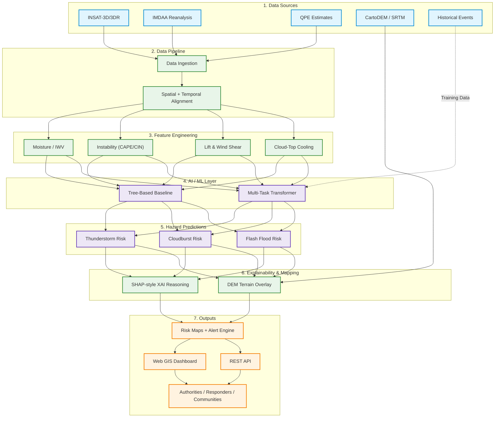

# HYPERCAST — Detailed Project Report

## Smart India Hackathon 2026
* **Problem Statement ID:** 26077
* **Problem Statement Title:** AI-Driven Hyper-Local Early Warning System for Severe Weather Nowcasting
* **Theme:** Disaster Management
* **Category:** Software
* **Team Name:** ARISHEM
* **Team ID:** [Add your Team ID]

---

## Table of Contents
1. [PROBLEM STATEMENT](#1-problem-statement)
2. [LITERATURE REVIEW / RESEARCH FOUNDATION](#2-literature-review--research-foundation)
3. [PROPOSED SOLUTION](#3-proposed-solution)
4. [DATA SOURCES & DATA PIPELINE](#4-data-sources--data-pipeline)
5. [FEATURE ENGINEERING](#5-feature-engineering)
6. [AI / ML ARCHITECTURE](#6-ai--ml-architecture)
7. [EXPLAINABLE AI](#7-explainable-ai)
8. [TERRAIN-AWARE HAZARD MAPPING](#8-terrain-aware-hazard-mapping)
9. [MULTI-HAZARD PREDICTION](#9-multi-hazard-prediction)
10. [SYSTEM ARCHITECTURE](#10-system-architecture)
11. [SOFTWARE ARCHITECTURE](#11-software-architecture)
12. [DASHBOARD & USER INTERFACE](#12-dashboard--user-interface)
13. [ALERTING SYSTEM](#13-alerting-system)
14. [FEASIBILITY ANALYSIS](#14-feasibility-analysis)
15. [CHALLENGES, RISKS & MITIGATION](#15-challenges-risks--mitigation)
16. [TESTING & VALIDATION STRATEGY](#16-testing--validation-strategy)
17. [EXPECTED OUTCOMES](#17-expected-outcomes)
18. [IMPACT ANALYSIS](#18-impact-analysis)
19. [SCALABILITY](#19-scalability)
20. [LIMITATIONS](#20-limitations)
21. [FUTURE SCOPE](#21-future-scope)
22. [NOVELTY / DIFFERENTIATION](#22-novelty--differentiation)
23. [IMPLEMENTATION ROADMAP](#23-implementation-roadmap)
24. [PROJECT STRUCTURE](#24-project-structure)
25. [REFERENCES](#25-references)
26. [APPENDIX](#26-appendix)

---

## 1. PROBLEM STATEMENT

### 1.1 Official Problem Statement

| Field | Detail |
| --- | --- |
| **Problem Statement ID** | 26077 |
| **Title** | AI-Driven Hyper-Local Early Warning System for Severe Weather Nowcasting |
| **Theme** | Disaster Management |
| **Category** | Software |
| **Team Name** | ARISHEM |

### 1.2 Problem Description
Severe weather events in hilly regions—specifically cloudbursts, thunderstorms, and flash floods—can form and unleash devastation within just a few hours. The rapid development time makes these events notoriously difficult to forecast. A cloudburst, defined as rainfall exceeding 10 cm in 1 hour over an area of approximately 10×10 km, is both too fast and too geographically local for standard forecasting paradigms. This results in warnings that are disconnected from the immediate reality of vulnerable hill communities.

### 1.3 Why Existing Approaches Are Insufficient
Current numerical weather prediction models have several critical limitations:
* **Forecast Timing Limitations:** Traditional models take too long to run. By the time a forecast is generated, the severe weather event may already be occurring.
* **Spatial Resolution Limitations:** Forecasts are too broad to determine which specific village or ward is at risk.
* **Hazard Siloing:** Thunderstorms, heavy rainfall, and flash floods are predicted separately, ignoring the sequential and compounding nature of these disasters.
* **Terrain Awareness Limitations:** Existing alerts lack the granularity to indicate exactly which slopes and river channels will bear the brunt of the runoff.
* **Explainability and Actionability Gap:** Warnings are issued without providing a reason, causing officials and residents to hesitate before taking action. People get little time and little reason to trust the alert before disaster strikes.

### 1.4 Problem Gap
There is a critical lack of a unified, fast, hyper-local, and terrain-aware nowcasting system that can predict interconnected hazards (storm, cloudburst, flash flood) while providing an explainable trigger to build trust. Despite the MoES confirming year-wise tracking of extreme-rain events since 2019, no public hyper-local nowcasting tool currently exists.

---

## 2. LITERATURE REVIEW / RESEARCH FOUNDATION

### 2.1 Problem Statement 26077 Document
* **Source:** Smart India Hackathon 2026
* **Key Contribution:** Establishes the core requirements for an AI-driven, hyper-local early warning system for severe weather nowcasting.
* **Relevance to HYPERCAST:** Forms the foundational objective and constraints of the proposed system.

### 2.2 MOSDAC: INSAT-3D/3DR Data Products
* **Source:** Space Applications Centre, ISRO (www.mosdac.gov.in)
* **Key Contribution:** Provides real-time and historical geostationary satellite data.
* **Relevance to HYPERCAST:** Serves as the primary observational input for spotting rapidly growing and cooling storm clouds before precipitation occurs.

### 2.3 IMDAA Reanalysis
* **Source:** NCMRWF / IMD / UK Met Office (rds.ncmrwf.gov.in)
* **Key Contribution:** High-resolution atmospheric reanalysis dataset over the Indian region.
* **Relevance to HYPERCAST:** Provides essential historical context and atmospheric metrics (air moisture, instability, wind) that fuel storm development.

### 2.4 WMO: Early Warnings for All Initiative
* **Source:** World Meteorological Organization (wmo.int/site/knowledge-hub)
* **Key Contribution:** A global initiative ensuring that everyone on Earth is protected by early warning systems.
* **Relevance to HYPERCAST:** Aligns the project with international disaster management standards and social impact goals.

### 2.5 ISRO Bhuvan: CartoDEM / Elevation Data
* **Source:** National Remote Sensing Centre (bhuvan.nrsc.gov.in)
* **Key Contribution:** Digital Elevation Model data providing high-resolution topographic information.
* **Relevance to HYPERCAST:** Essential for terrain overlay, allowing the system to map predicted rainfall to specific slopes, valleys, and river channels for flash flood risk.

### 2.6 Historical Scale and Defining Gaps
* **Source:** Decade-level studies (Indian Geophysical Union, 2012)
* **Key Contribution:** Records dozens of flash floods and 1,000+ lives lost.
* **Relevance to HYPERCAST:** Highlights the historical scale of the problem and the specific definition gap (10 cm+ rain in 1 h over ~10×10 km) that makes traditional forecasting ineffective.

---

## 3. PROPOSED SOLUTION

### 3.1 Overview
HYPERCAST is a proposed AI-driven hyper-local multi-hazard early warning and nowcasting system designed specifically for hilly regions. It bypasses slow traditional weather models by utilizing live satellite data, reanalysis products, and rainfall estimates to feed a multi-task AI architecture that predicts thunderstorms, cloudbursts, and flash floods simultaneously, with a targeted 2–6 hour lead time.

### 3.2 Design Goals
* Process data rapidly to provide actionable warnings 2–6 hours before onset.
* Achieve high-resolution precision on a regional grid (aiming for sub-district targeting).
* Unify the prediction of connected hazards.
* Maintain transparency and build trust through explainable AI (XAI).
* Ensure scalability and low deployment cost by utilizing free, public data without requiring dense sensor networks.

### 3.3 Core Capabilities

| Capability | Description |
| --- | --- |
| **Hyper-local nowcasting** | Provides risk assessments mapped to a fine grid adjusted for terrain. |
| **Multi-hazard prediction** | Predicts thunderstorm, cloudburst, and flash-flood risk together via a single model. |
| **Terrain-aware mapping** | Overlays atmospheric risk onto CartoDEM data to highlight vulnerable slopes and valleys. |
| **Explainable alerts** | Shows exactly which meteorological signal triggered the alert (e.g., cloud-top cooling). |
| **Fine-grid risk maps** | Visualizes hazards on a high-resolution grid for precise targeting. |
| **Dashboard** | Web GIS interface for live risk layers, history, and reports. |
| **REST API** | Pushes categorized warnings to NDMA/SDMA authorities and communities. |

### 3.4 End-to-End Concept
The system ingests and spatially/temporally aligns satellite, reanalysis, precipitation, and terrain data. A feature engine extracts storm warning signs (moisture, instability, wind shear, cloud cooling). An AI layer evaluates this data to predict the likelihood of thunderstorms, cloudbursts, and flash floods. XAI tools extract the reasoning behind the prediction, and terrain mapping determines the geographical impact. Finally, the categorized alerts and mapped risks are disseminated via a Web GIS dashboard and REST API.

---

## 4. DATA SOURCES & DATA PIPELINE

### 4.1 Data Sources

| Dataset | Source | Information Provided | Role |
| --- | --- | --- | --- |
| **INSAT-3D/3DR** | MOSDAC | Satellite images | Identifies storm clouds growing and cooling fast (first signs). |
| **IMDAA** | NCMRWF/IMD | Reanalysis data | Provides air moisture, instability, and wind profiles. |
| **QPE** | IMD | Rainfall estimates | Shows current rainfall intensity to catch extreme events. |
| **CartoDEM/SRTM**| ISRO Bhuvan | DEM terrain | Maps slopes and river channels to predict where water will rush. |
| **Past Event Records**| IMD / Studies | Historical data (e.g., Aug 2023) | Used to train and validate the machine learning models. |

### 4.2 Data Characteristics
The datasets include geostationary satellite imagery, gridded atmospheric reanalysis data, quantitative precipitation estimates, and high-resolution digital elevation models. Data arrives asynchronously and in varying resolutions.

### 4.3 Spatial Alignment
All incoming data is mapped onto a single common fine spatial map grid. This is critical because satellite imagery, reanalysis data, and terrain models have differing native resolutions. 

### 4.4 Temporal Alignment
Because satellite, rainfall, and reanalysis data arrive at different times and frequencies, the pipeline will utilize temporal interpolation to align all asynchronous data to a single unified timestamp before it is presented to the AI model.

### 4.5 Data Fusion
The data fusion engine integrates the spatially and temporally aligned matrices into a single multi-dimensional tensor. This unified structure ensures that the AI model can simultaneously assess the terrain context along with current atmospheric and rainfall conditions.

---

## 5. FEATURE ENGINEERING

The feature engine is designed to extract critical "storm warning signs."

### 5.1 Integrated Water Vapour / Moisture
* **What it represents:** The total amount of water vapor present in the atmospheric column (IWV).
* **Why it matters:** Moisture is the fundamental fuel for storm development and extreme precipitation.
* **Role:** Acts as a primary precondition indicator for potential cloudbursts.

### 5.2 CAPE / CIN
* **What it represents:** Convective Available Potential Energy (CAPE) and Convective Inhibition (CIN).
* **Why it matters:** Measures atmospheric instability. High CAPE indicates explosive updraft potential, while CIN acts as a cap that, when broken, leads to rapid storm development.
* **Role:** Evaluates the likelihood of severe convective activity.

### 5.3 Lift and Wind Shear
* **What it represents:** Mechanisms that force air upward and differences in wind speed/direction at various altitudes.
* **Why it matters:** Sustains and organizes storms, contributing to intensity and duration.
* **Role:** Helps differentiate between brief showers and sustained, severe thunderstorm systems.

### 5.4 Cloud-Top Cooling
* **What it represents:** The rate at which the temperature of the top of a cloud decreases, observed via INSAT infrared channels.
* **Why it matters:** A rapidly cooling cloud top indicates a powerful, fast-rising updraft—the first physical sign of an impending cloudburst.
* **Role:** Serves as an immediate, real-time trigger for nowcasting alerts.

### 5.5 Terrain Features
* **What it represents:** CartoDEM/SRTM elevation data outlining slopes, valleys, and river channels.
* **Why it matters:** Atmospheric conditions cause rain, but terrain dictates where the flood happens. Topography channels runoff and creates localized vulnerabilities.
* **Role:** Used in the post-prediction mapping phase to determine the exact geographical ground impact of the predicted rainfall.

---

## 6. AI / ML ARCHITECTURE

### 6.1 Model Overview
A multi-task spatiotemporal AI architecture, initially baselined on tree-based models (XGBoost/LightGBM) and scaling to a transformer network, is proposed to forecast these interconnected hazards.

### 6.2 Tree-Based Baseline
* **Purpose:** Serves as a computationally light fallback and the initial step in the "software-first build" approach.
* **Initial Validation:** Used to prove out the feature engineering pipeline and generate early validation results.
* **Fallback Role:** If transformer compute becomes a bottleneck, the tree-based model remains in place to guarantee uninterrupted warnings.

### 6.3 Multi-Task Spatiotemporal Transformer
* **Shared Backbone:** A single model digests the fused temporal and spatial data.
* **Temporal and Spatial Learning:** Capable of analyzing how storm clouds move and evolve over time across the geographical grid.
* **Multi-Task Learning:** Outputs separate but linked predictions for thunderstorms, cloudbursts, and flash floods simultaneously, leveraging shared representations of the underlying meteorological state.

### 6.4 Hazard Outputs
* **Thunderstorm risk:** Probability of severe convective storms.
* **Cloudburst risk:** Probability of extreme, localized rainfall (10cm/hr).
* **Flash-flood risk:** Probability of rapid flooding resulting from the precipitation.

### 6.5 Why Multi-Task Learning
Storms, heavy rain, and floods are physically linked in a chain of events. A unified multi-task model predicting all three can "see" this entire chain, recognizing patterns that separate models (e.g., one for storms, one for hydrology) might miss due to hazard siloing.

### 6.6 Model Development Strategy
The system is built step by step:
1. Start with a simple tree-based model for initial development.
2. Conduct historical validation (replaying past storms).
3. Upgrade to the multi-task spatiotemporal transformer.
4. Integrate the final model into the production pipeline.

---

## 7. EXPLAINABLE AI

### 7.1 XAI Architecture
The proposed system includes an explainability layer utilizing SHAP-style reasoning. This is integrated as part of the core design, not as an afterthought.

### 7.2 Alert Explanation
When the model triggers an alert, the XAI module identifies the specific input features (e.g., "rapid cloud-top cooling" or "high instability") that drove the prediction. It explicitly names the trigger.

### 7.3 Human Trust
Current warnings are often ignored because they are too broad and provide no justification. Providing a specific reason allows disaster-management officials and local communities to verify the threat and act with confidence, reducing the hesitation that costs lives.

### 7.4 Confidence + Reason
To balance the risk of false alarms versus missed alerts, every generated alert is accompanied by both a confidence level and the underlying XAI reason.

---

## 8. TERRAIN-AWARE HAZARD MAPPING

The atmospheric model predicts where extreme weather will occur, but the system must translate this into ground impact.

* **DEM Integration:** The system utilizes CartoDEM elevation data.
* **Slopes and Valleys:** It analyzes the topography to identify which slopes will shed water and which valleys will collect it.
* **River-Channel Context:** Identifies natural channels where hill water will rush, creating flash floods.
* **Ground-Impact Mapping:** The atmospheric risk is overlaid onto the DEM to map the precise geographic ground impact.
* **Fine-Grid Visualization:** The result is a fine-grid risk map that allows disaster authorities to interpret the danger at a highly actionable, village or ward level.

---

## 9. MULTI-HAZARD PREDICTION

The system treats Thunderstorms, Cloudbursts, and Flash Floods as a connected hazard chain rather than isolated events.
Atmospheric instability and lift create a **Thunderstorm**. Extreme updrafts within that storm lead to a **Cloudburst**. The massive volume of water hitting steep terrain results in a **Flash Flood**.
By utilizing one shared model backbone that learns these linked hazards, the system captures the interdependent probabilities of this chain of events.

---

## 10. SYSTEM ARCHITECTURE

### High-Level Flow
```
INSAT / IMDAA / QPE / DEM / Historical Events
↓
Data Ingestion & Alignment (Grid & Timestamp)
↓
Feature Engine (Moisture, Instability, Lift, Cooling)
↓
AI/ML Layer (Tree-Based Baseline & Multi-Task Transformer)
↓
Multi-Hazard Risk Prediction (Storm, Cloudburst, Flood)
↓
XAI Reasoning & DEM Terrain Overlay
↓
Risk Maps + Alert Engine
↓
Web GIS Dashboard + REST API (Authorities, Responders, Communities)
```

### Detailed Architecture Diagram


---

## 11. SOFTWARE ARCHITECTURE

### Backend
* **Python / Node.js:** Responsible for the data ingestion pipeline, temporal/spatial alignment, model inference, and serving the REST API.
* **PostgreSQL + GeoJSON:** Relational and spatial database architecture for storing grid-level risk assessments, historical event data, and terrain geometries.

### Frontend
* **React.js:** Powers the user interface for the Web GIS dashboard.
* **GIS map layer:** Integrates spatial data visualization for risk mapping over geographical areas.

### AI/ML
* **Spatiotemporal Transformer:** Primary model for multi-hazard prediction.
* **Tree-based baseline:** Fallback model and initial validation tool.
* **SHAP-style XAI:** Generates human-readable explanations for predictions.

### Deployment
* **Cloud training:** Heavy model training (especially for the transformer) utilizes cloud infrastructure.
* **Edge / cloud inference:** Operational predictions run efficiently on ordinary cloud machines or edge nodes, as predictions run on a predefined grid.

---

## 12. DASHBOARD & USER INTERFACE

The proposed Web GIS dashboard serves as the central visualization hub for end users.
* **Live risk layers:** Visualizes the real-time probability of storms, cloudbursts, and flash floods on a fine grid.
* **Historical information & Reports:** Allows users to view past events and system performance.
* **Hazard categories:** Delineates risks by type and severity.
* **Terrain overlays:** Shows exactly which slopes and river channels are threatened.
* **Explanation information:** Displays the XAI-generated reason (the trigger) alongside the alert confidence.

*(Note: Specific UI screenshots are not specified in the current proposal; the interface is proposed based on Web GIS standards utilizing React.js).*

---

## 13. ALERTING SYSTEM

* **Target Lead Time:** 2–6 hours before the onset of the severe weather event.
* **Risk Categories:** Categorized warnings based on severity.
* **Confidence & Explanation:** Every alert includes a confidence level and the XAI-derived reason to build trust.
* **Geographic Scope:** Village or ward-level precision based on the fine-grid predictions.
* **Dissemination:** Handled via a REST API to push categorized warnings.
* **Intended Recipients:** Disaster authorities, first responders (field teams), and hill communities.

---

## 14. FEASIBILITY ANALYSIS

### 14.1 Data Feasibility
Highly feasible. INSAT, IMDAA, QPE, and CartoDEM are all free and public open data sources. No new hardware sensors or paid data subscriptions are required.
### 14.2 Computational Feasibility
Predictions are designed to run on a grid, allowing prototypes to execute on ordinary cloud machines. The inclusion of a tree-based baseline acts as a fallback against the high compute costs associated with the full transformer model.
### 14.3 Software Feasibility
The software-first build relies on a Web GIS map and an API to deliver alerts. There is no custom hardware to manufacture, simplifying the development lifecycle.
### 14.4 Deployment Feasibility
Uses open standards (Python, Node.js, React, PostgreSQL) making it cheap and standard to deploy in cloud environments.
### 14.5 Operational Feasibility
Explainability is built-in from day one, ensuring that the system produces outputs that operational authorities can actually trust and use.

---

## 15. CHALLENGES, RISKS & MITIGATION

| Challenge | Impact | Proposed Mitigation |
| --- | --- | --- |
| **Rare-event imbalance** | Cloudbursts are rare, so a model may learn to ignore them. | Test on real past events and give rare events extra weight utilizing techniques like Focal Loss and physics-informed data augmentation. |
| **Data out of sync in time** | Satellite, rainfall, and reanalysis data arrive at different times. | Put all data on one grid and one timestamp before the model sees it. |
| **False alarms vs. missed alerts** | Too many false alarms lose trust. Misses cost lives. | Show a confidence level with each alert, along with the reason behind it. |
| **High compute for full transformer**| Large AI models can be slow and costly to run. | Keep the tree-based baseline as a fallback that still gives warnings. |
| **Limited labelled event history** | Few recorded past events are available to learn from. | Replay historical storms and add augmented samples to expand training data. |

---

## 16. TESTING & VALIDATION STRATEGY

### 16.1 Validation Region
Himachal Pradesh monsoon belt (selected because it is hilly and highly flood-prone, providing a tough real-world test).
### 16.2 Historical Event Replay
August 2023 Mandi–Shimla–Solan events (re-running past floods through the pipeline as if they were live).
### 16.3 Evaluation Approach
Predicted onset time vs. actual onset time.
### 16.4 Target
Achieving a usable lead time within a 2–6 hour window, providing enough time for people to act.
### 16.5 Validation Metrics
* Predicted vs. actual onset time.
*(Note: Standard ML metrics such as F1, AUROC, etc. are Potential Future Evaluation Metrics not explicitly specified in the current proposal).*

---

## 17. EXPECTED OUTCOMES

The implementation of HYPERCAST is expected to deliver:
* **Earlier warnings:** Targeting a 2–6 hour window for action.
* **Fine-grid risk:** Localization mapped to a high-resolution regional grid.
* **Multi-hazard outputs:** Simultaneous 3-in-1 prediction of storms, cloudbursts, and flash floods.
* **Explainability:** Clear, meteorologically sound reasons for every alert.
* **Terrain awareness:** Ground-impact mapping based on slopes and valleys.
* **Decision support:** Equipping authorities to confidently close risky roads and order targeted evacuations.

---

## 18. IMPACT ANALYSIS

### 18.1 Social Impact
* Saves lives in flood-prone hill areas by giving residents time to evacuate.
* Protects remote villages that do not have radar or rain gauges nearby.
* Builds public trust in the early warning system through clear, explained alerts.

### 18.2 Economic Impact
* Less damage to homes, roads, bridges, and crops.
* Targeted alerts avoid the massive financial costs of unnecessary blanket evacuations.
* Utilizes free public data, making the system extremely cheap to deploy.

### 18.3 Environmental Impact
* Supports ongoing river-basin and watershed monitoring.
* Provides better data for long-term climate-risk planning.
* Operates as a software-only solution, requiring no dense physical sensor network installation in sensitive environments.

### 18.4 Operational / Disaster-Management Impact
* **Authorities (NDMA / SDMA / Districts):** Get early, explained, terrain-aware alerts to order evacuations, close roads, and send relief with clear justification.
* **First Responders (Field Teams):** Know exactly where and when risk will peak, allowing rescue teams and equipment to be placed in advance, not after the flood.
* **Hill Communities (Villages / Wards):** Receive 2–6 hours of notice to move families, livestock, and vehicles to safer ground.

---

## 19. SCALABILITY

HYPERCAST is designed for vast scalability:
* **Wider Coverage:** Can be extended to cover more river basins across India.
* **Mobile Alerts:** Future integration to push warnings straight to community phones.
* **Authority Integration:** Designed to plug via REST API directly into existing NDMA / SDMA dashboards.
* **Additional Hazards:** The same backbone model can be extended to include heatwaves and landslides in the future.

---

## 20. LIMITATIONS

Based on the proposal constraints, explicit limitations include:
* **Rare Extreme Events:** The fundamental rarity of cloudbursts presents ongoing class imbalance challenges during training.
* **Limited Labelled History:** There is a scarcity of well-documented, high-resolution historical events to learn from.
* **Data Synchronization:** Maintaining strict temporal and spatial alignment of asynchronous data sources in real-time is complex.
* **Compute Requirements:** The full spatiotemporal transformer poses high compute costs for inference, necessitating the tree-based fallback.
* **Antecedent Factors:** Flash floods depend heavily on soil moisture and prior rainfall, which are not currently explicitly modelled, creating a potential gap in flood accuracy.
* **False Positives/Negatives:** The ongoing tension between false alarms (eroding trust) and missed alerts (costing lives) requires constant threshold tuning.

---

## 21. FUTURE SCOPE

The proposed future scope encompasses:
* **Wider coverage:** Extending monitoring to more river basins across India.
* **Mobile alerts:** Pushing warnings straight to community mobile phones.
* **Model upgrade:** Moving completely from the tree-based baseline to the full transformer.
* **Authority integration:** Direct plug-in integration into NDMA / SDMA dashboards.
* **More hazards:** Adding heatwave and landslide predictions to the same model backbone.

---

## 22. NOVELTY / DIFFERENTIATION

HYPERCAST differentiates itself through:
* **High-resolution forecasting:** Aiming for sub-district targeting rather than broad district warnings.
* **Multi-hazard prediction:** Linking storm, rain, and flood into a unified causal chain.
* **Terrain-aware risk:** Mapping atmospheric threat directly to ground topography.
* **Explainable alerts:** Naming the exact trigger for transparency.
* **Public-data-first approach:** Requiring zero new hardware or sensor deployments.
* **Software-first deployment:** Ensuring rapid, low-cost scalability.

---

## 23. IMPLEMENTATION ROADMAP

* **Phase 1 — Data acquisition:** (Proposed) Integration with MOSDAC, IMDAA, QPE, Bhuvan APIs.
* **Phase 2 — Alignment and preprocessing:** (Proposed) Grid mapping and timestamp synchronization.
* **Phase 3 — Feature engineering:** (Proposed) Extraction of moisture, instability, shear, and cooling rates.
* **Phase 4 — Tree-based baseline:** (Proposed) Development of initial fallback model.
* **Phase 5 — Historical validation:** (Proposed) Replay of Aug 2023 Himachal floods.
* **Phase 6 — Transformer development:** (Proposed) Training the multi-task spatiotemporal backbone.
* **Phase 7 — XAI + terrain mapping:** (Proposed) SHAP integration and DEM overlay.
* **Phase 8 — Dashboard/API:** (Proposed) React.js and Node/Python backend setup.
* **Phase 9 — Deployment:** (Proposed) Cloud training and inference setup.
* **Phase 10 — Scale and new hazards:** (Future Scope) Extension to landslides/heatwaves and new basins.

---

## 24. PROJECT STRUCTURE

Proposed repository structure for HYPERCAST implementation:

```text
hypercast/
├── frontend/        # React.js Web GIS Dashboard
├── backend/         # Node.js/Python REST API for alerts
├── ai-service/      # Python inference service (Transformer & Tree-based models)
├── models/          # Saved model weights and architecture definitions
├── data/            # Data ingestion scripts (MOSDAC, IMDAA, QPE, CartoDEM)
├── notebooks/       # Jupyter notebooks for EDA and historical event replay
├── docs/            # Project reports, architecture diagrams (like this file)
├── scripts/         # Spatial/temporal alignment and feature engineering scripts
├── README.md        # Project overview
└── LICENSE          # Open-source license
```

---

## 25. REFERENCES

1. **Problem Statement 26077 Document**: SIH 2026 official problem statement document.
2. **MOSDAC**: INSAT-3D/3DR data products. URL: [www.mosdac.gov.in](https://www.mosdac.gov.in)
3. **IMDAA reanalysis**: NCMRWF / IMD / UK Met Office. URL: [rds.ncmrwf.gov.in](https://rds.ncmrwf.gov.in)
4. **WMO**: Early Warnings for All initiative. URL: [wmo.int/site/knowledge-hub](https://wmo.int/site/knowledge-hub)
5. **ISRO Bhuvan**: CartoDEM / elevation data. URL: [bhuvan.nrsc.gov.in](https://bhuvan.nrsc.gov.in)
6. **Market/Impact Research - Rising Toll**: Aug 2023 Himalayan cloudburst floods killed 70+ across Himachal Pradesh and Uttarakhand.
7. **Market/Impact Research - Recent Repeat**: Aug 2025 Kishtwar (J&K) cloudburst flash flood killed 60+, even in a normal rainfall season.
8. **Tracking Gap**: MoES confirms year-wise tracking of extreme-rain events since 2019 (Rajya Sabha, Jul 2024), yet no public hyper-local nowcasting tool exists.
9. **Historical Scale**: Decade-level studies recorded dozens of flash floods and 1,000+ lives lost (Indian Geophysical Union, 2012).
10. **Definition Gap**: Cloudburst = 10 cm+ rain in 1 h over ~10×10 km: too fast and local for standard forecast lead times.

---

## 26. APPENDIX

### Hazard Definitions (As per proposal constraints)
* **Cloudburst:** Rainfall exceeding 10 cm in 1 hour over a spatial area of approximately 10×10 km.

### Validation Notes
* **Target Event:** August 2023 Mandi–Shimla–Solan floods.
* **Methodology:** The event will be replayed using archived satellite and meteorological data to simulate a live environment, testing the model's ability to provide a 2–6 hour actionable warning prior to the documented onset time.
